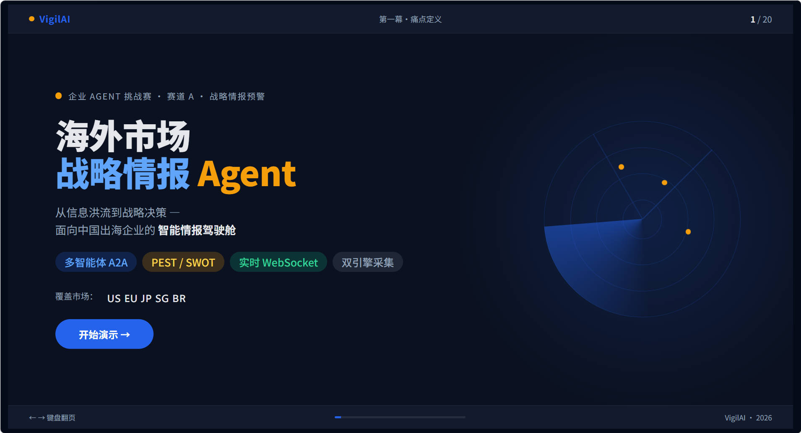

<!--
  ============================================================
  作者：冯伟雄
  项目：深圳 AI for Human 企业 Agent 挑战赛 · 最佳应用落地奖
  时间：2026-05-23
  奖项：最奖落地应用奖
  ============================================================
-->



# Strategic Radar · 海外市场战略情报 Agent

## 🏆 最佳应用落地奖

**深圳 AI for Human 企业 Agent 挑战赛 · 赛道 A · 战略模拟器**

| | |
|---|---|
| **指导单位** | 龙岗区人工智能（机器人）署 |
| **主办单位** | 深圳市人工智能与机器人研究院（AIRS） · OpenAgent 产业联盟 |
| **协办单位** | 香港中文大学（深圳）数据科学学院 · 香港中文大学（深圳）人工智能协会（AIA） |
| **赛事定位** | 全国首个聚焦企业级 AI Agent 落地能力的挑战赛 |
| **获奖选手** | 冯伟雄 |
| **开发周期** | 约 26 小时（现场限时赛） |

---

## 赛事与挑战

本次挑战赛由深圳市人工智能与机器人研究院（AIRS）与 OpenAgent 产业联盟联合主办，聚焦企业级 AI Agent 的真实落地能力，要求参赛者在 **约 26 小时** 内从零构建一个可运行的企业级产品。

### 赛题任务

为一家业务覆盖多个海外市场的品牌型企业（5,000+ 门店、30,000 员工、5 大核心市场），构建一个海外市场战略情报 Agent：

- **不接入任何企业内部数据**，仅从公开源（新闻、社媒、行业报告、电商平台公告等）主动采集
- **结构化分析归纳**，输出「每日战略简报」支持管理层快速决策
- **开放探索**方向：信息筛选逻辑、分析框架设计、输出结构与人机协同

### 核心难点

| 痛点 | 具体场景 |
|---|---|
| 市场信息高度分散 | 新闻、报告、社群资料分散，人工查阅耗时易遗漏 |
| 判断依赖个人经验 | 不同负责人标准不一，难以形成可对比结论 |
| 缺乏结构化决策输入 | 资讯零散，晨会中无法快速形成明确行动方向 |
| 市场变化与决策时间差 | 法规及平台政策调整往往事后才被注意到 |

### 26 小时交付物

> 从零开始，一个人，26 小时，交付一个完整可运行的企业级战略情报系统。

- 多源采集 / 五维分析 / 三档简报 / 多通道推送 / 多智能体协同
- 134 候选信息源、9 个驾驶舱页面、6 大 API 模块
- 全链路可运行，一键启动

---

## 一句话定位

> 一个**真正可落地的企业级战略情报中枢** —— 通过自定义数据源，面向**任何行业、任何企业**，成为其全天候的「市场雷达 + 决策外脑」。

---

## 核心架构理念

> **「采集是工程问题，不该交给 LLM；LLM 是认知问题，不该拿去跑爬虫。」**

我们拒绝了"LLM 直搜"和"第三方爬虫平台"两条路线，选择了**职责分离**：

| 采集层（工程问题） | 分析层（认知问题） |
|---|---|
| 134 候选信息源 · 35 路由 · 18 真实采集函数 | PEST 自动分类 · 4 维价值评分 |
| 自编采集器 · 快 · 稳 · 免费 | SWOT 跨象限策略 · 战略简报生成 |
| 失败自动仿真兜底 | DeepSeek 真流式 · Mock 兜底 |

让擅长工程的工程师写采集器，让擅长理解的 LLM 做分析师。

---

## 五大亮点

### 1. 企业级骨架

Django 4.2 + DRF + Channels + Daphne ASGI + Celery + Redis + PostgreSQL 全套企业组合，安全配置全开，凭证零泄漏。

### 2. 134 真实信息源

覆盖 FRED / SEC / GDELT / Reddit / arXiv / Reuters / BBC 等权威公开源，三档采集模式（auto / simulated / real），失败自动降级。

### 3. DeepSeek token 级真流式

基于 SSE 的 token 级流式输出直达浏览器，24 小时缓存节省 70%+ token，无 API Key 时自动切 Mock 模式，零配置可跑通。

### 4. 全自动结构化分析

- **PEST 分类**：每条情报自动标注 P/E/S/T 维度
- **4 维评分**：紧迫度 × 权威性 × 相关度 × 影响面
- **SWOT 矩阵**：基于公司画像自动生成四象限策略
- **三档简报**：Daily / Weekly / Monthly 可配置调度

### 5. 多通道闭环 + 多智能体协同

邮件 / 飞书 / 短信 / Webhook 多通道推送，24h 幂等去重；4 节点 A2A 协议编排采集→分析→简报→通知全链路。

---

## 通用行业适配

> 换一份信息源 JSON + 改一份公司画像 = 一个新行业的战略雷达。

| 行业 / 规模 | 典型应用 |
|---|---|
| **跨境电商 / 品牌出海** | 多市场动态、平台规则变动、KOL 声量监控 |
| **新能源 / 制造业** | 原材料价格监控、关税政策跟踪、海运运力告警 |
| **医疗 / 大健康** | 临床试验进度、药监审批、学术前沿追踪 |
| **金融 / 投研** | 宏观因子日报、监管政策预警、舆情风控 |
| **VC / 战略咨询** | 赛道动态、竞品融资、团队动向 |
| **政府 / 智库** | 区域经济监测、招商情报、突发事件感知 |
| **大公司 / 小团队 / 个人自媒体** | 行业资讯聚合、竞品动态追踪、热点事件预警、内容选题线索 |

---

## 驾驶舱一览

| 页面 | 说明 |
|---|---|
| 情报蓝图 | 全局态势驾驶舱 |
| 今日简报 | 日/周/月三档简报浏览 |
| 市场动态 Feed | 情报流 + 真流式 LLM 分析 |
| 跨市场时间线 | 时间维度对比 |
| 采集调度 | 任务状态与详情 |
| 信息源配置 | 134 信息源管理 |
| 通知记录 | 推送日志与模板 |
| 系统配置 | 公司画像 / LLM / 调度 / 通知渠道 |
| 智能体控制台 | Agent 节点 Canvas 画布 |

---

## 快速开始

```powershell
# 1. 安装依赖
pip install -r requirements.txt

# 2. 配置环境变量
Copy-Item .env.example .env
# 编辑 .env（LLM_API_KEY 留空可走 Mock 模式）

# 3. 数据库迁移与种子加载
python manage.py migrate
python manage.py loaddata data/data_source_1.json data/data_source_2.json data/data_source_3.json
python manage.py collectstatic --noinput

# 4. 一键启动
.\start.bat
```

访问 `http://127.0.0.1:8000/` 即可进入驾驶舱。

---

## 演示文稿

浏览器打开 [presentation/index.html](presentation/index.html)（独立运行，无需后端）。

---

## 许可

本项目为深圳 AI for Human 企业 Agent 挑战赛参赛作品，仅用于教学与赛题演示。所有采集均面向公开信息源，遵循各源的 robots / Rate Limit / ToS 约定。
